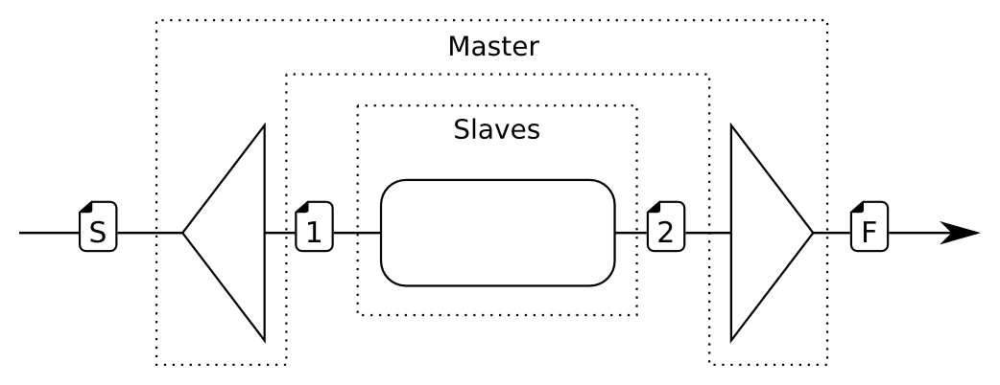

Program parallelization on clusters of PCs — Project: Sieve of Eratosthenes
===========================================================================

Author: Jeremiah Menétrey
Due date: Nov. 20, 2013

Description of the application
------------------------------

The sieve of Eratosthenes is an classic algorithm to find prime numbers up to a given integer. The algorithm works as follows:

Given a list of unmarked integers $[2..L]$ where $L$ is the upper limit of candidate primes
1. Find $n$, the next unmarked number in the list
2. Mark all multiples of $n$, except for $n$ itself
3. Repeat *1-2* until all numbers up to $\sqrt{L}$ have been processed
4. The numbers left unmarked in the list are prime numbers

### Algorithmic complexity ###
The complexity of the algorithm depends on $L$ and the number of primes in the list up to $\sqrt{L}$. It can be proved that the actual complexity is $O(n \log \log n)$, as the prime harmonic series asymptotically approaches $\log \log n$.[^algoComplexity]

### Achievable speedup ###

TODO (Upper bound!)

Parallelization strategies
--------------------------

In this section, it is assumed that every process has a unique ID (called *pid*) and every process knowns its own ID as well as the IDs of all other processes (so they also know the number of processes).
The number of processes is denoted $p$, and processes *pid* is within the range $[1..p]$. There might also be a *master* process, which is not counted in $p$ and has the *pid* $0$.

Both strategies below use the fact that chunks of the list of candidate primes need not to be send over the network. It is sufficient to communicate the upper limit $L$ of the original list, the size of the chunks $S$ or both, to be able to build locally a representation of the chunk with the correct bounds, using the *pid* of the process. Except if stated otherwise, when the communication of a chunk is implied, $L$, the size of the chunks or both are actually sent over the network, depending on the situation.

### First strategy: The easy one ###
The master process computes the primes up to $\sqrt{L}$. Every time it finds a prime, it broadcasts it to all the slaves. When done, it broadcasts a special FIN message indicating that it has finished.

The slaves are each responsible of a different chunk of the candidate primes. When a slave receives a prime from the master, it marks all the multiples of that prime in its chunk. When it receives the FIN message, the slave collects all unmarked numbers (i.e. all primes) in its chunk and sends them back to the master.

It must be noted that the master is actually doing a sieving with an upper limit of $\sqrt{L}$, which means that it can stop the sieving after reaching $\sqrt[4]{L}$.

#### Discussing the strategy ####
This strategy is very simple and still might achieve good results by letting the master process handle a small portion of the list while allowing to parallelize the processing of the big portion.

This technique scales very well for the portion of the list greater than $\sqrt{L}$. In facts, for a given $L$, the size of the chunk processed by each slave is inversely proportional to the number of slaves. In the extreme case where there are $L - \lfloor \sqrt{L} \rfloor$ slaves (i.e. one slave for each number greater than $\sqrt{L}$), the limiting factor will be given by the rate at which the master will broadcast new primes, which is not parallelized with this strategy.

Another downside of this strategy is the memory limitation: If there are not enough slaves to hold the entire second portion of the list, the algorithm won't work as-is. Caching the primes sent by the master might be a way to overcome the limitation, however the benefits of the on-the-fly sieving (sieving a chunk while the master continuously sends new primes) would not be applicable for all chunks after the first $p$ ones.

##### Computational complexity #####
Let $k$ be the number of primes up to $\sqrt{L}$. The prime counting function[^primeCountingFunction] $\pi(n)$ gives the number of primes up to $n$, so we have the relation $k = \pi(L)$.

* Each slave will be handling a chunk of size $S = L/p$, and therefore will be performing $k$ loops over $S$ elements. So the parallel computation time is $k(L / p)$.
* The master will send $kp$ messages (broadcasting the primes) and receive $p$ messages (the primes found by the slaves), amounting to a total of $p(k+1)$ messages.
* Computation/Communication ratio: $\frac{kL}{(k+1)p^2} = O(L)$.

The longer the list of candidate primes, the smaller the impact of communications.

##### DPS flow graph #####

![[S]](images/dps-flow_data-s.png) A dummy object signaling to the `Split` process that it can start.
![[1]](images/dps-flow_data-1.png) Contains a list of primes and optionally the *FIN* signal.
![[2]](images/dps-flow_data-2.png) Contains an *ACK* signal and optionally a list of primes.
![[F]](images/dps-flow_data-f.png) A dummy object signaling the end of the sieve.

As DPS requires that each message sent through the `Split` generates a message received by the `Merge` (TODO: Verify claim), the slave processes must send an acknowledgment message to the merge even if they are not able to send the list of primes in their chunk yet.

When the master sends the last prime to the slaves, it signals that there are no more primes coming by setting the *FIN* flag. When slaves have done processing their chunk with the last primes, they send the *ACK* message with a list of all the primes they found.

The master does the sieving up to $\sqrt{L}$ in the `Split` operation and collects the primes from the slaves in the `Merge`.

### Second strategy: Incremental sieve ###
This strategy leads to a parallel incremental sieve, where each process is responsible for a chunk of the whole list (which might then theoretically be infinite).

The strategy involves a turn-based approach, where at step $i$ the process responsible of the $i$-th chunk **finishes** that chunk, i.e. it finds all remaining primes in it.

At step $i$ process with *pid* $i$ performs the finishing sieve on its chunk then broadcasts the newly found primes to all other processes, which perform the sieve on their own chunk using the broadcast primes. Then at step $i+1$, process $i+1$ finishes its own chunk. Again, it broadcasts the newly found primes and all other processes perform the sieve on their own chunk with the primes found by process $i+1$. And so on...

Additionally, each process keeps the whole list of primes found so far, including those broadcast by other processes (which actually amounts to a kind of *shared* list of primes). This allows each process to start processing a new chunk as soon as they found all primes in their chunk. A new chunk is first sieved using the shared list of primes, then the normal processing can resume. When process $p$ has found all primes in his chunk, process $1$ can continue (as if it were the process $p+1$).

If the list of candidate primes is bounded (i.e. there is an upper limit $L$), the algorithm stops after the chunk $l$ that contains $\sqrt{L}$ is finished. When process *pid* $l$ finishes, it sends the new primes to other processes, which in perform the sieve using the new primes found by process $l$ on all their remaining chunks (i.e. without communication). When done, all processes send the primes they found in that last big round (over several chunks at once) to the master.

Finally, the master process with *pid* $0$ is only responsible for initiating the sieve, by broadcasting the initial conditions to all other processes, such as the limit $L$, an initial list of primes and the lower bound for the sieve (which is actually the upper bound $L$ of the initial list of primes), the size of the chunks, the number of processes, and other parameters if needed. If the list of candidate primes is unbounded, process $0$ can also be responsible of collecting occasionally the shared list of primes to save it or display it to the client.

Aside from communications from and to process $0$, which are negligible, this strategy requires only the communication of newly found primes to all processes (the broadcast that updates the shared list of primes), which happens once for every chunk.

If we imagine the setting as a pipeline, it would be a five-stage pipeline with the following stages:

| Stage     | Description                        |
| --------- | ---------------------------------- |
| Update    | Receive new primes and update list |
| Sieve I   | Sieve chunk using updated primes   |
| Sieve II  | Sieve chunk for new primes         |
| Broadcast | Broadcast newly found primes       |
| Sieve III | Sieve new chunk using list         |

Stages *Sieve II*, *Broadcast* and *Sieve III* are only performed by a process when it is its turn to finish a chunk. Non-finishing processes only perform the *Update* and *Sieve I* stages before exiting the pipeline.
Additionally, it must be noted that the *Update* and *Broadcast* stages must happen at the same time, i.e. all non-finishing processes must be in the *Update* stage when the finishing one is in the *Broadcast* stage.
Finally, it can be noted that this design allows for the *Sieve III* stage to take up to the time needed for *Sieve I* and *Sieve II* combined, which might be useful as *Sieve III* is actually the same as *Sieve I* except that it uses all primes found so far instead of only the primes of the last update.
However, since the pipeline is only conceptual, it is possible to relax the *Sieve III* stage by merging it with *Update* and *Sieve I* while buffering incoming broadcasts.

#### Discussing the strategy ####
This strategy is more involved than the first one and requires that processes are synchronized in order to implement the pipelined setting as described above. Hopefully, the synchronization is easily done using the communication stages *Update* and *Broadcast*.

The strategy distributes the serial part of the algorithm over several processes, which might hinder performances as the serial part is interleaving with communications in order to change round (in terms of the first strategy, it is like switching the role of *master* to another process).

The clear advantage of this strategy over the first one is that it allows to continue sieving as long as the available memory and the implementation allow to represent numbers the application has to deal with. Another advantage in the bounded version is that if the number of processes is limited and $L$ is very big, this strategy will gracefully handle all the numbers while the first strategy will hit memory limitations (as each slave has to handle a chunk of size $(L - \sqrt{L}) / p$) as it has to finishes in one "round". In this strategy, the chunks size is limited, e.g. to the maximum memory available, and the number of rounds is flexible.

On the communications side, their number is comparable to that of the first strategy in terms of number of sent primes, and even less if we count the number of messages: unlike the first strategy, where the master sends a message for at least each prime up to $\sqrt[4]{L}$, in this strategy a message is sent only once for each finished chunk.

##### Computational complexity #####
The bounded version of the strategy is used to formulate its computational complexity.

Again, let $k = \pi(\sqrt{L})$ the number of of primes up to the square root of the bound $L$. The number of rounds is $r = \sqrt{L} / S + 1$. The size of the chunks $S$ is arbitrary and the number of chunks $s = L/S$. $l$ is the chunk that contains $\sqrt{L}$, i.e. $l = \sqrt{L} / S$, and by extension the number of the round in which chunk $l$ is finished.

* Each process will have to loop at most $k$ times over each of their chunk. The parallel computation time is therefore $ksS = kL$.
* Each process will send one message per chunk, up to chunk $l$. Then each process will send one message to the master. The total number of messages is therefore $l + p = p + \sqrt{L} / S$.
* The C/C ratio is therefore: $\frac{kL}{p + \sqrt{L} / S} = O(\sqrt{L})$.

##### DPS flow graph #####
TODO

Detailed theoretical analysis
-----------------------------

TODO

<!-- Footnodes -->
[^algoComplexity]: [http://en.wikipedia.org/wiki/Sieve_of_Eratosthenes#Algorithm_complexity]()
[^primeCountingFunction]: [http://en.wikipedia.org/wiki/Prime_number#Number_of_prime_numbers_below_a_given_number]()